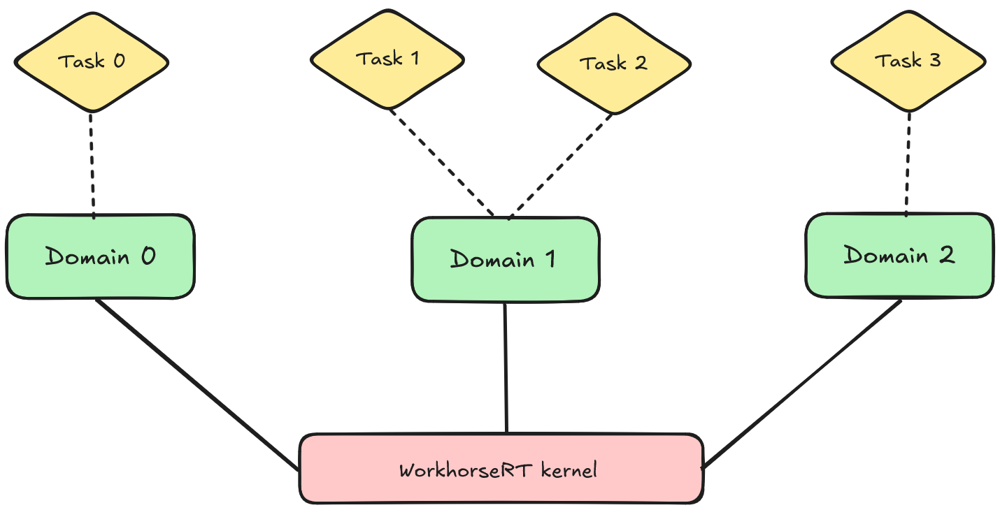
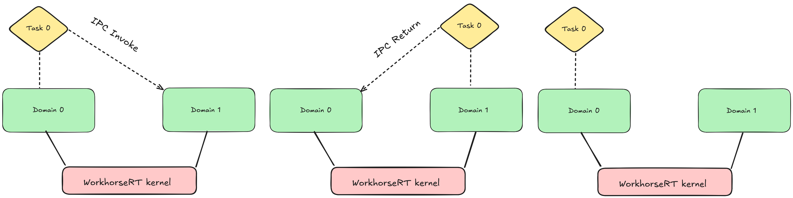

# High Level Design

WorkhorseRT is designed from the ground up to minimize interference, a problem that is inherent in most operating systems, particularly those that rely heavily on blocking APIs (including those that provide timeouts), locks or highly contended lock-free data structures, and even more so when BKLs are involved.

The system is static, tasks and domains are to be predefined, and initialized by plugins before control is transferred to the kernel. 
This eliminates contention in the kernel core (excluding architecture specific code) entirely, allowing for better determinism.

Design goals: 
- **Portability across architectures**  
    Hardware specific code is isolated, and the kernel makes no assumptions about the underlying hardware 

- **Resource efficiency and the ability to run with tight resource constraints**  
    Suitable for systems with low amounts of memory

- **Deterministic and replayable execution**  
    Behaviour is predictable and reproducible under identical conditions.

- **Freedom from interference**  
    Interference is prevented by the kernel core having no shared resources between cores, eliminating contention entirely. Plugins are free to make use of techniques to improve isolation such as cache partitioning and memory bandwidth throttling.
    
- **Small and verifiable core**  
    The kernel core is approximately 3k lines of .c, keeping the TCB small and verifiable. Formal modelling and verification of the core is ongoing.

## Scheduling

WorkhorseRT has a configurable scheduler supporting multiple throttling algorithms and policies. The scheduler is designed such that new policies can be easily implemented if required.

Partitioned scheduling is used, where each task is statically assigned to a specific core. This improves determinism and replayability by eliminating cross core migrations, making it much better suited for hard real-time systems.

Throttling algorithms:
- Burst Cooldown Server (BCS)
- Deferrable Server (DS)

Policies:
- Round Robin (RR) with up to 256 configurable priority levels
- Earliest Deadline First (EDF)
- Cyclic with a configurable number of frames

## Domains

Domain are isolated execution environments, which can contain their own address space, IPC permissions and programs, tasks run inside domains.

Domains and tasks are created statically by plugins and cannot be created nor destroyed after control is handed off to the kernel.
Plugins are responsible for setting up each domains memory layout, this includes loading programs, setting up MMIO regions assigned to domains and establishing any shared memory regions between domains. This allows for flexibility in how programs are loaded, whilst keeping the system static.

Domains serve as the fundamental unit of isolation, whereas tasks serve as the fundamental unit of scheduling in WorkhorseRT.

## Interrupts

WorkhorseRT allows for interrupt handlers to run inside userland domains as tasks. 
This is done via the use of LSRs (Link Service Routines) which run at higher priority than threads in response to some hardware event such as an interrupt. 

LSRs run with interrupts enabled and are allowed to take exceptions and IPC like any thread can. 

Interrupt priority levels are also supported, an LSR woken up in response to a hardware event can preempt an already running LSR if the event is higher priority than the one being handled.

This allows for better interrupt latency, and the ability to prioritize critical hardware events.

Care must be taken to ensure deadlocks don't occur, 
e.g., it may not be a good idea for an LSR to grab a lock that can be grabbed by a thread.

## IPC

WorkhorseRT implements synchronous IPC via thread migration.
When a task is authorized to invoke a domain, the kernel transfers that task into the callee domain and executes it inside the callee’s address space. This is not to be confused with LRPC.

This allows for IPC to be wait-free and allocation free, multiple tasks invoking the same domain can migrate into it in parallel without blocking each other.
However, this holds up as long as the domain’s logic is written to support that level of concurrency.

Alternatively, plugins can establish shared memory regions between domains, for asynchronous IPC without migration.

